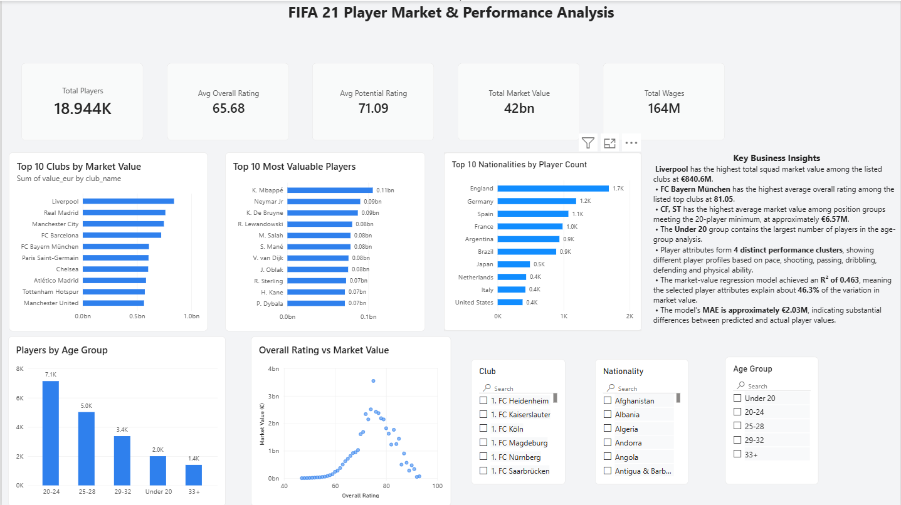

# FIFA 21 Player Market & Performance Analysis

An end-to-end data analytics project using FIFA 21 player data to analyze player performance, market value, wages, age groups, clubs, nationalities, and player attributes.

The project combines Python, Machine Learning, and Power BI to transform raw player data into meaningful insights and an interactive business dashboard.

---

## 📌 Project Overview

This project analyzes FIFA 21 player data to understand:

- Player performance and ratings
- Player market values and wages
- Most valuable players and clubs
- Player distribution by age group
- Player distribution by nationality
- Relationship between overall rating and market value
- Player performance profiles using clustering
- Market value prediction using Machine Learning

The project follows an end-to-end data analytics workflow, from data cleaning and exploratory analysis to machine learning and dashboard development.

---

## 🎯 Objectives

- Analyze player performance and market value
- Identify the most valuable players and clubs
- Analyze players by age group and nationality
- Explore the relationship between overall rating and market value
- Analyze player attributes such as pace, shooting, passing, dribbling, defending, and physical ability
- Build a Machine Learning regression model for market value prediction
- Use clustering to identify different player performance profiles
- Build an interactive Power BI dashboard
- Generate meaningful business insights from the data

---

## 🛠️ Tools & Technologies

- Python
- Pandas
- NumPy
- Matplotlib
- Seaborn
- Scikit-learn
- Jupyter Notebook
- Power BI
- Power Query
- DAX

---

## 🔄 Project Workflow

Raw FIFA 21 Dataset  
↓  
Data Cleaning  
↓  
Exploratory Data Analysis  
↓  
Feature Engineering  
↓  
Machine Learning  
↓  
Power BI Dashboard  
↓  
Business Insights

---

## 🤖 Machine Learning

A regression model was developed to analyze the relationship between player attributes and market value.

### Market Value Prediction

The selected player performance features were used to predict player market value.

### Model Results

- **R² Score:** 0.463
- **MAE:** Approximately €2.03M

The model explains approximately **46.3% of the variation in player market value**.

The MAE of approximately **€2.03M** represents the average absolute difference between predicted and actual market values.

### Clustering

Clustering was also used to identify **4 different player performance profiles** based on attributes such as:

- Pace
- Shooting
- Passing
- Dribbling
- Defending
- Physical ability

---

## 📊 Power BI Dashboard

The Power BI dashboard provides an interactive analysis of FIFA 21 player market values, ratings, wages, age groups, clubs, and nationalities.

### Dashboard Features

- Total Players
- Average Overall Rating
- Average Potential Rating
- Total Market Value
- Total Wages
- Top 10 Clubs by Market Value
- Top 10 Most Valuable Players
- Top 10 Nationalities by Player Count
- Players by Age Group
- Overall Rating vs Market Value
- Club slicer
- Age Group slicer
- Nationality slicer

### Dashboard Preview

---

## 💡 Key Business Insights

- **Liverpool** has the highest total squad market value among the listed clubs at approximately **€840.6M**.
- **FC Bayern München** has the highest average overall rating among the listed top clubs at approximately **81.05**.
- The **20–24 age group** contains the largest number of players.
- **England** has the highest player count among the nationalities shown.
- Player attributes form **4 distinct performance clusters**, representing different player profiles.
- Overall rating shows a noticeable relationship with player market value.
- The regression model achieved an **R² score of 0.463**.
- The model's **MAE is approximately €2.03M**.

---

## 📁 Project Structure

FIFA21-Player-Market-Analysis/

├── data/  
│   └── fifa21_players_cleaned.csv  
│  
├── notebooks/  
│   └── FIFA_Player_Analysis.ipynb  
│  
├── powerbi/  
│   └── FIFA21_Player_Market_Analysis.pbix  
│  
├── images/  
│   └── dashboard.png  
│  
└── README.md

---

## 📂 Project Files

### Dataset

`data/fifa21_players_cleaned.csv`

Cleaned FIFA 21 player dataset used for analysis and visualization.

### Jupyter Notebook

`notebooks/FIFA_Player_Analysis.ipynb`

Contains the data cleaning, exploratory data analysis, feature engineering, machine learning, regression, and clustering work.

### Power BI Dashboard

`powerbi/FIFA21_Player_Market_Analysis.pbix`

Interactive Power BI dashboard containing KPIs, charts, slicers, and business insights.

### Dashboard Image

`images/dashboard.png`

Preview image of the Power BI dashboard.

---

## 🚀 Skills Demonstrated

- Data Cleaning
- Data Wrangling
- Exploratory Data Analysis
- Feature Engineering
- Statistical Analysis
- Data Visualization
- Machine Learning
- Regression
- Clustering
- Model Evaluation
- Power BI
- Power Query
- DAX
- Dashboard Design
- Business Insight Generation

---

## 🧠 Conclusion

This project demonstrates an end-to-end **Data Analytics workflow** using FIFA 21 player data.

Starting with data cleaning and exploratory analysis, the project uses Machine Learning to investigate player market value and performance patterns. The findings are then presented through an interactive Power BI dashboard.

The project demonstrates how raw data can be transformed into meaningful insights using **Python, Machine Learning, and Power BI**.

---

## 👤 Author

**Anmol Sagar**

Aspiring Data Analyst | Python | SQL | Power BI | Machine Learning
